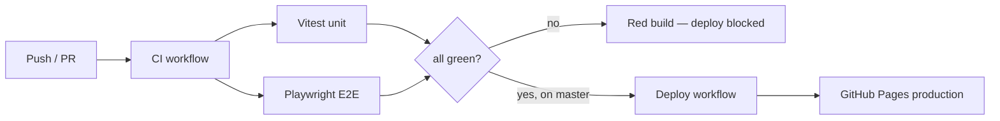

# Bubble Pop Chain — Testing & CI/CD Skill

This skill describes how to fully test the game end to end and how the
production deployment is gated on those tests. There is **no mocking of game
code**: unit tests exercise the real modules, and E2E tests drive the real
running game in a real Chromium browser.

## Layout

| Path | Purpose |
| --- | --- |
| `tests/unit/*.test.js` | Vitest logic/integration tests (jsdom) |
| `tests/e2e/game.spec.js` | Playwright E2E tests (real browser, real input) |
| `tests/server.mjs` | Zero-dependency static server used by tests & preview |
| `tests/setup.js` | Deterministic in-memory `localStorage` for unit tests |
| `vitest.config.js` | Vitest config (jsdom env, coverage) |
| `playwright.config.js` | Playwright config (mobile + desktop projects, webServer) |
| `.github/workflows/ci.yml` | Test gate — runs on every push/PR |
| `.github/workflows/deploy.yml` | Builds `dist/web` and deploys it to GitHub Pages only after CI passes |
| `.github/workflows/mobile.yml` | Native Android/iOS validation workflow, manual and PR-scoped |
| `.github/workflows/store-release.yml` | Manual signed Android/iOS store package workflow |
| `docs/store-release.md` | Store signing, compliance, listing, and release checklist |

## Commands

```bash
npm install                 # install dev deps (first time)
npm run test:install        # install Playwright Chromium (first time / CI)

npm run test:unit           # Vitest unit + integration (fast)
npm run test:e2e            # Playwright E2E (real browser)
npm test                    # unit then e2e — the full gate

npm run build:web           # copy the static app into dist/web
npm run native:sync         # copy dist/web into Android/iOS Capacitor projects
npm run android:sync        # sync only Android; does not require Xcode
npm run ios:sync            # sync only iOS; requires full Xcode + CocoaPods
npm run android:build       # build a local Android debug APK
npm run android:apk:release # build a signed Android release APK when signing env vars are set
npm run android:bundle      # build a release Android App Bundle (signing still required)
npm run android:bundle:release # build a signed AAB when Android signing env vars are set
npm run ios:build           # unsigned iOS build via xcodebuild (requires Xcode)
npm run ios:archive         # release iOS archive (requires Xcode + signing)

npm run test:unit:watch     # TDD watch mode
npm run test:e2e:ui         # Playwright interactive UI mode
npx playwright show-report  # open the last HTML E2E report
npm run serve               # preview the game at http://127.0.0.1:4173
npm run dev                 # alias for npm run serve
```

## How "real" testing works (no mocking)

- **Unit tests** import the actual `src/*.js` modules and assert on real
  behaviour: RNG determinism, level difficulty curve, scoring/combo math,
  flood-fill + gravity + column collapse, power-up effects (including Paint's
  impact-ranked recolour suggestions), the coin economy,
  daily-streak rules, theme unlock logic, storage persistence, the
  monetization cadence (forced interstitials gated until level 7), gesture
  swipe classification, the Power-meter charge curve + Charged-Blast AoE,
  Fever-mode scoring (gauge gain + double-points), the combo escalator
  (`comboTier`/`COMBO_TIERS` mapping a combo count to its named tier +
  `ct-1..ct-5` class), the cascade chain bonus (`cascadeBonus`/`cascadeTier`/
  `CASCADE_TIERS` — a flat escalating per-chain-link bonus that pays nothing
  below `CASCADE_MIN`, steps up by `CASCADE_STEP` and caps at `CASCADE_CAP`),
  per-theme background music profiles (`MUSIC_PROFILES`/`musicProfile` — each
  theme resolves to its own well-formed procedural track with distinct scales,
  and unknown ids fall back to the aurora track),
  the procedural SFX engine (every effect — `pop`/`powerup`/`fever`/`blast`/
  `click`/`win`/`lose`/`coin` — is callable and a safe no-op without an
  AudioContext, and Fever/Charged-Blast have their own distinct signatures
  rather than reusing the power-up blip),
  the weekly tournament (`tournament.js` — `weekKey` ISO-week formatting,
  one seeded board shared across the week, deterministic modifier pick, the
  four-tier rank ladder, and `recordTournament` keeping the highest weekly best
  with a clean rollover/reset when a new week starts),
  Time Attack board refills (`grid.refill` regenerates a full, solvable board
  so the timed mode never deadlocks) + its `highScoreTimeAttack` storage default,
  the achievements engine
  (lifetime progress merge, threshold unlocks, coin payouts, and
  `aggregateChestRewards` which merges many chests into one summary — summing
  coins, merging power-ups by id, and gathering pets + categories for Collect All),
  the colourblind symbol set (distinct glyph per colour, enough for every level),
  the memoized bubble colour helpers (`renderer.js` `hexToRgb`/`shade`/`lighten`
  — outputs pinned byte-for-byte so the per-frame render cache can't drift the
  on-screen colours, and `hexToRgb` proven to return a stable cached reference;
  the base bubble polish is intentionally validated as a renderer smoke/syntax
  concern because it is procedural Canvas layering over the same helpers),
  the reduced-motion accessibility flags (`ScreenShake.motionScale` gates added
  trauma at the `add()` chokepoint — 0 disables shake entirely; `ParticleSystem.
  motionScale` scales `burst`/`sparkle` counts down and skips shockwave `ring`s
  below the threshold; `settings.reducedMotion` defaults off and round-trips),
  the idle move-hint scan (`findHint` returns the largest poppable group or
  `null` on a deadlock) and the per-level best-score store (`recordLevelScore`
  keeps the highest and flags a genuine new best),
  the world-map chapters (`chapterForLevel` tiles the authored 40 levels into 5
  themed chapters of 8 and generates procedural chapters past level 40, with a
  Roman-numeral suffix on repeats) plus the endless/generative campaign
  (`LEVEL_COUNT=9999`, difficulty ramps then plateaus at `DIFFICULTY_CAP` so two
  high levels share scaling and stay winnable forever),
  the per-level bonus objectives (`objectiveForLevel`: deterministic combo/
  group/nopowerup challenges, skipped on early + milestone levels),
  the milestone beats (`bossConfig` rotates the three boss archetypes
  frozen→stone→color across lvl10/20/30/40 with the right
  `kind`/`label`/`hudLabel`/`extraMoves`, the frozen core/stone vault fit their
  boards, and `placeStoneVault`/`stoneRemaining` lock + count a centred vault),
  the login calendar (`calendarStatus`/`advanceCalendar`: 7-day cycle, one claim
  per day, reward index wraps after a full week),
  the season pass (`season.js`: tiersUnlocked thresholds, tierReward tracks,
  canClaim gating on premium ownership/unlock state, seasonStatus progress +
  claimable counts, addSeasonXp/claimTier immutability + idempotency, locked
  power-up reward conversion in `economy.js`,
  unlockPremium),
  the daily & weekly quests (`quests.js`: seeded daily/weekly selection,
  ensureQuests reroll on day/week change, applyQuestProgress count+max+cap +
  newlyComplete, claimQuest claimable/idempotent, questsClaimable count,
  immutability),
  the stats/profile dashboard (`stats.js`: formatStat grouping + clamping,
  lifetimeStats from achievement progress, profileStats defaults, buildStats
  shape),
  the piggy bank (`piggy.js`: piggyEarn floor/zero-guard, piggyDeposit cap +
  added, canCrackPiggy threshold, piggyFillPct 0..1 clamp),
  puzzle mode (`puzzle.js`: ladder integrity, getPuzzle shape/clamp, puzzleStars
  thresholds + 1..3 bounds, isPuzzleUnlocked gating, puzzlesSolved count),
  the pet companion system (catalog integrity + premium flags, XP/level curve,
  staged feature unlock helpers (`PET_FEATURE_UNLOCKS`, feature info copy,
  `isPetFeatureUnlocked`, `petFeaturesUnlockedBetween`, `nextPetFeatureUnlock`),
  passive buff scaling, active-pet cooldown/strength/count scaling, expanded
  long-progression catalog coverage (Mochi/Sprout/Luma/Archer/Amp/Prism/Midas), seeded
  crate rolls including the rare premium drop chance + the boosted Legendary
  Crate roll, premium-pet catalog filter, the pity timer (`pityRarityFloor`/
  `nextPity` thresholds + dry-streak guarantee) + Pet Dust economy
  (`dustValue`/`dustCost` tables, `rollCrate` floor) + pet acquisition UI labels
  that explain normal crate/craft paths versus premium/store-only paths + pet personality traits
  (`TRAITS` table integrity, `rollTrait` seeded/in-range, `getTrait` Balanced
  fallback, trait mods nudging `petActive` cooldown/count/strength and
  `petBuffs` passive mults incl. active-only pets) + party & set synergies
  (`partyBuffs` lead-full/support-fraction aggregation, `SYNERGIES` table +
  `activeSynergies` matching, `applySynergies`/`partyTotalBuffs` fold-on), and
  the storage pet helpers — grant/equip/XP/crates/cosmetics/dust/pity/trait +
  party supports (`getPartySupports`/`toggleSupport` add/remove/cap/lead-eviction))
- **gems** (`tests/unit/gems.test.js`): the gems & sockets RPG module — gem
  catalog/tier integrity, `socketsForLevel` level-gating (0/1/2), the tier power
  ladder (`gemTierIndex`/`levelForGemTier`/`maxGemTierForLevel`/
  `canSocketGemAtLevel` so chipped/polished/brilliant unlock at Lv.2/4/5 within
  the broader Lv.12 pet progression and a
  too-strong gem is rejected on a low-level pet),
  `gemKey`/`parseGemKey`/`gemLabel`/`gemIcon`/`gemValue` key round-trips,
  `socketBuffs` passive aggregation (ruby single-axis, diamond `allMult`
  all-axes, emerald active-only contributes nothing), `socketActiveMods`
  (emerald cooldown delta), `gemDustCost` tier escalation + fallback, the
  **embue/shatter dust economy** (`socketDustCost` 20/60/150 cheaper than
  crafting + fallback, `unsocketDustRefund` 8/24/60 always < the embue cost),
  `gemBuffLabel` human-readable effect strings (`+12% Score`, `+6% all stats`,
  `-3 move ability cooldown`, junk→""), **gem fusion**
  (`FUSE_COUNT`=3, `nextGemTier` ladder chipped→polished→brilliant→null,
  `canFuseTier`, `fusedGemKey` maps a key one tier up / null at the top or junk),
  and
  `rollGem` seeded determinism + `tierBias` nudging toward higher tiers. Storage
  coverage adds the gem inventory (`addGem`/`gemCount`/`spendGem`/`getGems`
  clamp+prune+persist, `fuseGems` atomic 3→1 merge that leaves surplus untouched
  and no-ops without a target/enough gems) and per-pet sockets (`getSockets`/`socketGem` with
  displaced-gem-returns-to-bag + maxSlots bound/`unsocketGem` **shatters the gem
  (returns the key but does NOT refund it to the bag)**, default Sparky
  `sockets:[]`, persistence); `pets.test.js` adds the socket-fold cases
  (a ruby raises `petBuffs.scoreMult`, a diamond lifts all axes, an emerald
  shortens `petActive.cooldown` clamped ≥1, undefined-sockets backward compat);
  `events.test.js` adds the `{type:"gem"}` gift reward slice and the
  `PROBLEM_EFFECTS` roll coverage for the five missed-problem hazards.
- **tech** (`tests/unit/tech.test.js`): the pet technology tree module — tree
  structure (10 tiers × 2 options, `minLevel` 2/3/4/5/6/7/8/9/10/12, unique node ids, every
  node has icon/name/desc/non-empty mods), `techNode`/`techTierOf`/`techTierAt`/
  `techTierOptions` lookups, `techTiersUnlocked` level-gating, `pendingTechTier`
  (first unlocked unpicked tier, -1 when none), `hasPendingTech`, `canPickTech`
  (only the pending tier, no skipping ahead / no re-picking), `techBuffs` passive
  aggregation (`1+sum` per axis, overdrive lifts all four, unknown ids ignored),
  and `techActiveMods` (cooldown/count summed, strength multiplied, neutral when
  empty). `pets.test.js` adds the tech-fold cases (a score node raises
  `petBuffs.scoreMult`, gems+tech stack multiplicatively on the same axis,
  overdrive all-axes, `t3_haste` shortens `petActive.cooldown`, `t4_mastery`
  boosts count+strength, undefined-tech backward compat). Storage coverage adds
  `getPetTech`/`addPetTech` (idempotent per node, fresh-array return, empty for
  unowned, default Sparky `tech:[]`, no-op on unowned).
  plus the grid helpers it relies on
  (dominant colour, first-cell-of-colour, isolated-cell detection,
  most-isolated-cell ranking for the Talon pick pet, and deterministic
  `arrowRay` pathing for Archer's drag skill shot),
  special bubbles (rainbow wildcard + ice two-hit + lightning row/column
  strike + bomb 3×3 detonation + multiplier gold-score-boost + coin
  treasure-drop + vine creeping-threat spread + stone
  locked-bubble: never tappable, shattered
  only by an adjacent pop, and excluded from `hasMoves`) with type round-trip,
  plus renderer coverage that special-bubble SVG overlays use local vendored
  Game-icons assets only, the
  last-bubble finale animator (`BubbleFinale`: variant clamping to 0–4,
  onExplode fires exactly once at the glow→blast boundary, onDone fires once at
  completion, cancel, and draw in both phases) plus the grid helpers it relies
  on (`firstFilledCell` locates the lone bubble, `forceRemove` clears one cell
  regardless of type incl. ice), the
  daily retention engine (modifiers, tiered goals/stars, weekly rewards,
  streak-freeze rescue), the interactive tutorial (step-table invariants,
  deterministic teaching-board generation, and gated step advancement), and the
  particle system (burst/sparkle spawn counts, update-driven expiry, local-only
  Kenney sprite particle assets, sprite lifecycle/reduced-motion/capping, and the
  capped pool that trims the oldest particles so a pop storm can't grow the
  per-frame draw cost without bound; plus `popStyleForGroup`'s five escalating
  group-pop explosion styles and the expanding shockwave `ring` lifecycle/cap).
  `localStorage` is a real spec-compliant store
  (`tests/setup.js`), reset before each test.
- **E2E tests** load the real page, click real DOM buttons, and dispatch real
  pointer taps on the `<canvas>`. They cover: the `?e2e=1`-only **Test Lab**
  save/progression helper (hidden in normal play; reset/jump/grant buttons mutate
  the real save), grouped menu/level-map/shop/themes
  navigation, popping via real taps, scoring, win/lose, revive and double-coins
  rewarded-ad flows, endless refill, daily streak, the full power-up/tool set,
  the Paint tool's smart three-colour picker and repaint flow,
  progressive tool unlocks (fresh players see no HUD/shop/loadout tools or locked
  Pick rescue prompts, Level 5→6 shows the **New Tool Unlocked!** mini-tutorial before starting the next
  level, and claiming the win bonus after the reward chest also opens that popup), progressive pet unlocks (fresh players do not see the Pets tile,
  Level 11→12 shows the pet feature unlock window, grants/equips Sparky, then
  starts the next level with the HUD pet badge), the level-map **Current focus**
  card and **Next unlock** teaser, pre-level briefings before a map cell starts play (including replay records), post-win bonus choices
  after opening the reward chest, smart suggested loadouts in the long-press picker,
  retry coaching on campaign losses, shop purchases, shop affordability affordances (`.cannot-afford`/`.need-coins`),
  the in-game pause overlay (`#pause`) freezing the level, resuming, and routing
  to Menu, HUD status chips, hold-to-buy auto-repeat (a held buy button keeps purchasing at the
  configured rate, shows live buying/limit feedback, respects the visible
  hold-purchase limit preference, and stops when coins run out), "remove ads", theme buy/apply,
  sound toggle, PWA service-worker
  registration, manifest reachability, local special-bubble SVG asset
  reachability, progress persistence across reloads,
  resuming an in-progress campaign level (save & Continue), real-input
  gestures (long-press Preview, double-tap Charged Blast, swipe row-shift),
  undo tool use (the loadout Undo charge restores the board/score/moves, a
  consumed power-up is refunded on undo, and the rewind stack is capped),
  special-bubble spawning + reload persistence, lightning row/column discharge,
  bomb-bubble 3×3 detonation on pop, multiplier gold-bubble score boost,
  coin treasure-bubble bonus-coin drop,
  vine creeping-threat spread + clear,
  no forced ads before level 7,
  the boss archetypes (a frozen-core boss shows the `Core` objective + unlocks a
  theme on victory, a stone-vault boss shows `Stone` and is won by shattering
  every locked stone, and a colour-purge boss shows `Left` and is won by clearing
  every marked bubble of its target colour),
  Fever mode (double points + gauge lighting up), the combo escalator
  (the banner's tier class + label escalating with the chain length),
  the cascade chain bonus (sustaining a chain adds the exact escalating flat
  bonus to the pop's score; the opening pop of a chain pays none),
  per-theme background music (entering a level starts the current theme's
  procedural track and quitting stops it; muting silences it without stopping
  the sequence),
  the weekly tournament (starting it builds the week's seeded board with goals
  and a 9999-move high-score session; finishing a run records the weekly best,
  shows the earned rank, and surfaces the best on the menu summary),
  Time Attack (starting it runs a 60s, full, refilling board with a Time
  countdown HUD; the clock running out ends the run and banks a personal best),
  general screen countdowns (campaign/puzzle/daily/tournament show a countdown
  status chip and a campaign timeout resolves as Time's Up),
  the group-pop explosion styles (a popped group selects the style + shockwave
  rings + local sprite VFX matching its size, and a forced big group fires the
  top "supernova" tier with rings + flash + sprite particles),
  the achievements flow
  (badge unlock + coin reward, the Achievements screen, tutorial play excluded,
  and the Collect All button which batch-collects every ready chest in one tap
  and shows the aggregate reveal),
  colourblind mode (toggle flips the renderer flag, persists, applies on reload),
  reduced-motion mode (the Themes `#rm-toggle` zeroes `shake.motionScale`, thins
  `particles.motionScale`, adds the `reduced-motion` body class, persists, and is
  re-applied on reload) plus the core ARIA metadata (canvas `role="img"`+label,
  toast `aria-live` status region, win/lose dialogs) and the menu-footer hit-test
  guard (the informational top-right `.menu-foot` computes `pointer-events:none`
  so it can never intercept clicks on the centred menu buttons),
  the idle move-hint assist (a hint surfaces after idling, any input clears it,
  and the Themes toggle disables/suppresses it), per-level best score (a clear
  records a best shown on the level map, beating a prior best celebrates a
  "New best score"),
  the world-map chapter headers on the level map (5 authored themed chapters
  with level ranges, plus procedural chapters revealed past level 40 with
  generated level cells), the per-level bonus objectives (HUD chip shown on
  ordinary levels +
  hidden on milestones, meeting one pays a coin bonus on the win screen),
  the season pass (Season screen lists the 10-tier ladder, earning XP unlocks +
  pays out a free tier, locked tool rewards display/claim as coins, the premium
  track is gated until the pass is purchased, and the menu badge appears when a reward is claimable),
  the daily & weekly quests (Quests screen lists 3 daily + 1 weekly goal,
  gameplay pops feed progress, completing one makes its reward claimable, locked
  tool quest rewards claim as coins, and the
  menu badge counts claimable rewards),
  the stats/profile dashboard (Stats screen renders a Profile section + Lifetime
  Totals section of 8 cells each, lifetime totals reflect persisted progress,
  and the profile shows the live coin balance),
  the piggy bank (shop shows the Piggy card locked when empty, finishing a level
  banks coins into the vault, and cracking pays the whole balance into the wallet
  then re-locks),
  puzzle mode (the Puzzles screen lists the 12-rung ladder with only the first
  unlocked, solving puzzle 1 records ≥1 star + unlocks the next, and running out
  of moves without clearing the board fails the attempt with no revive),
  the last-bubble finale (leaving exactly one bubble triggers the glow+explode
  finale with a random style 0–4, suspends input, clears the board to win the
  level, and waits for earlier pop sprites to finish before starting),
  the pet companions flow (with pet progression unlocked for these mature-system
  tests: Pets screen with Sparky owned/equipped,
  guided pet-detail chips/actions and the `#pet-gem-tip` socket guidance strip,
  buy + open a crate grants a pet, pet detail/cards explain crate/craft versus
  premium/store-only acquisition, the Pet Store sells premium pets + a
  Legendary Crate that grants a pet, buying a premium pet unlocks it,
  duplicate crate pulls grant Pet Dust + the crate panel shows the balance and
  local `.crate-art` CSS graphics (no remote asset dependency),
  the pity timer guarantees rarer pets after dry opens, an equipped pet's trait
  modifies its buffs, the
  Pets screen shows the party panel with a lead slot, adding a support pet folds
  its buffs into the equipped party, and a matching party grants a set synergy
  bonus,
  winning a new pet fires the `#pet-reveal` celebration showing its name/rarity/
  ability with an Equip & Play CTA, equipping
  refreshes the live
  session buffs, a startCharge pet pre-fills the power meter, an active pet
  arms its gather action, the diagonal pet blasts a streak, the Archer pet waits
  for a real player drag then fires a line shot, the pick pet (Talon)
  picks off the most isolated bubbles one by one, premium IAP grants ownership,
  HUD pet badge),
  the pet gems & sockets flow (the Pets screen shows the `#pet-gems` panel with
  **🎒 Bag / ⚒️ Forge tabs**; the Forge tab shows per-type tier craft buttons,
  crafting a gem with dust adds it to inventory +
  spends dust and rejects unaffordable crafts, sockets unlock with pet level,
  socketing a ruby raises an equipped pet's live score buff, an emerald shortens
  an equipped active pet's live cooldown, **embuing costs dust and is rejected
  when the player is broke**, **removing a socketed gem opens the `#gem-remove`
  warning modal and shatters the gem for a partial dust refund** (the gem is
  destroyed, not returned to the bag), a crate open can drop a loose gem, a
  low-level pet can only socket low-tier gems, the gem picker advertises each
  gem's `gemBuffLabel` effect (`.pg-buff`) and its embue cost (`.pg-x`), a
  successful UI embue plays one of 5 random magic flourishes
  (`_lastSocketMagic` 0–4), tapping an empty socket opens a visible centered
  gem-picker overlay, **the Bag grid (`.pg-grid2 .pg-cell`) selects a gem and
  surfaces its detail (`.pg-sel-buff`) + a fusion action**, a `.pg-fuse-btn`
  merges 3 same-tier gems through the UI, and the Fuse button is disabled below
  3 gems),
  the pet technology tree flow (the pet detail shows the `#pet-detail .pd-tech`
  tree with a pending pick at Lv.2 and locked future tiers, picking a node
  records it and raises the pet's live buff (chosen node shown locked-in), a
  higher tier can't be picked before its level is reached, and the menu Pets tile
  badges a pet with a pending upgrade then clears once picked),
  the daily retention flow (summary, streak reward),
  falling gift/problem anti-idle rules (ambient tokens do not spawn before board
  interaction, the event clock pauses after board inactivity, and a real board
  pop arms the next ambient token),
  buying a power-up refreshing the HUD tool-slot count,
  a performance guard (a heavy pop storm keeps the particle pool capped and it
  still drains to empty afterwards, with sprite particles separately capped), and the gated
  step-by-step tutorial (first-run auto-open, How to Play replay, skip, the
  practice board auto-refilling so the player never runs out of bubbles, and a
  full walkthrough that performs each real gesture to advance). Both a mobile
  (Pixel 7) and a desktop Chromium profile are run.

### The test hook

`src/main.js` exposes internals **only** when the page is opened with
`?e2e=1`:

```js
if (/(?:\?|&)e2e=1\b/.test(location.search)) {
  window.__bpc = { game, Storage, Economy, Monetization, UI, getLevel };
}
```

Production sessions never set this query param, so the hook stays dormant. The
hook only *exposes* the real objects to let tests set up deterministic
scenarios (e.g. force a near-loss, force a board clear) and assert internal
state — it never substitutes game logic.
The main menu also shows a compact **Test Lab** only under `?e2e=1`; its reset,
unlock-jump, and grant buttons call the same real `Storage`/`Economy` APIs used
by the game so local progression testing does not require manual DevTools edits.

> Note: the in-game ad/IAP provider (`src/monetization.js`) is itself an
> intentional mock *feature stub* awaiting a real ad SDK. Tests exercise that
> real shipped code path; they do not add additional mocking on top. The mock
> is **pluggable** — `Monetization.setProvider(p)` injects a real SDK and the
> unit tests cover both the mock fallback and the delegation/policy contract
> (cadence, new-player grace, ads-removed gate, and the manager-owned
> remove-ads side-effect surviving any provider).

## CI/CD — test before production (required)



- **`ci.yml`** runs on every push and pull request: two parallel jobs, `unit`
  (Vitest) and `e2e` (Playwright on Chromium). The Playwright HTML report is
  uploaded as a build artifact. If anything fails, the build is red.
- **`deploy.yml`** is triggered by `workflow_run` on **completion of CI for the
  `master` branch** and only proceeds when `conclusion == 'success'`. This is
  the production gate: a failing test suite means no deploy. It runs
  `npm run build:web` and publishes only `dist/web` to GitHub Pages so native
  Android/iOS project files are never uploaded as site content.
- **`mobile.yml`** validates the native deployment targets when mobile files
  change in a PR, or by manual dispatch: Android produces a debug APK artifact;
  iOS performs an unsigned Xcode build on macOS.

### Native local prerequisites
- Android: Android Studio or command-line SDK installed, `ANDROID_HOME` pointing
  at that SDK, platform `android-35`, and JDK 21 on the path (or `JAVA_HOME`).
- iOS: full Xcode selected with `xcode-select`, CocoaPods installed, and an
  Apple Developer team configured in Xcode for device/TestFlight/App Store
  signing. Command Line Tools alone are not enough for `ios:sync`/`ios:build`.

### One-time repo setup for deploys
1. Repo **Settings → Pages → Build and deployment → Source: GitHub Actions**.
   (GitHub Pages on a *private* repo requires a paid plan; otherwise make the
   repo public or swap the deploy step for another static host — the test gate
   is host-agnostic.)
2. Ensure Actions are enabled. No secrets are required for Pages.

## Extending the suite
- **New logic** → add a `tests/unit/<module>.test.js`; import the real module.
- **New UI/flow** → add a test to `tests/e2e/game.spec.js`; prefer real clicks
  and `tapCell()` for canvas input. Use the `?e2e=1` hook only to set up or
  read state, not to bypass behaviour.
- Keep tests deterministic: levels/daily use seeded RNG, so assert on seeds and
  derived values rather than random outcomes.

## Acceptance bar before release
- `npm test` is green locally and in CI (unit + E2E, both browser profiles).
- No console errors on load; service worker registers; manifest is valid.
- Coverage of all gameplay code paths: pop/scoring/combo, gravity/collapse,
  win/lose/revive/double, endless, daily, three power-ups, shop, themes,
  persistence, and resume/continue of an in-progress level.
