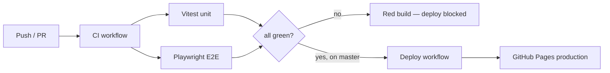

# Bubble Pop Chain — Testing & CI/CD Skill

This skill describes how to fully test the game end to end and how the
production deployment is gated on those tests. There is **no mocking of game
code**: unit tests exercise the real modules, and E2E tests drive the real
running game in a real Chromium browser.

## Layout

| Path | Purpose |
| --- | --- |
| `tests/unit/*.test.js` | Vitest logic/integration tests (jsdom) |
| `tests/e2e/game.spec.js` | Playwright E2E tests (real browser, real input) |
| `tests/server.mjs` | Zero-dependency static server used by tests & preview |
| `tests/setup.js` | Deterministic in-memory `localStorage` for unit tests |
| `vitest.config.js` | Vitest config (jsdom env, coverage) |
| `playwright.config.js` | Playwright config (mobile + desktop projects, webServer) |
| `.github/workflows/ci.yml` | Test gate — runs on every push/PR |
| `.github/workflows/deploy.yml` | Deploys to GitHub Pages only after CI passes |

## Commands

```bash
npm install                 # install dev deps (first time)
npm run test:install        # install Playwright Chromium (first time / CI)

npm run test:unit           # Vitest unit + integration (fast)
npm run test:e2e            # Playwright E2E (real browser)
npm test                    # unit then e2e — the full gate

npm run test:unit:watch     # TDD watch mode
npm run test:e2e:ui         # Playwright interactive UI mode
npx playwright show-report  # open the last HTML E2E report
npm run serve               # preview the game at http://127.0.0.1:4173
```

## How "real" testing works (no mocking)

- **Unit tests** import the actual `src/*.js` modules and assert on real
  behaviour: RNG determinism, level difficulty curve, scoring/combo math,
  flood-fill + gravity + column collapse, power-up effects, the coin economy,
  daily-streak rules, theme unlock logic, storage persistence, the
  monetization cadence (forced interstitials gated until level 7), gesture
  swipe classification, the Power-meter charge curve + Charged-Blast AoE,
  Fever-mode scoring (gauge gain + double-points), the achievements engine
  (lifetime progress merge, threshold unlocks, coin payouts),
  the colourblind symbol set (distinct glyph per colour, enough for every level),
  the idle move-hint scan (`findHint` returns the largest poppable group or
  `null` on a deadlock) and the per-level best-score store (`recordLevelScore`
  keeps the highest and flags a genuine new best),
  the world-map chapters (`chapterForLevel` tiles all 40 levels into 5 themed
  chapters of 8 with no gaps),
  the per-level bonus objectives (`objectiveForLevel`: deterministic combo/
  group/nopowerup challenges, skipped on early + milestone levels),
  the login calendar (`calendarStatus`/`advanceCalendar`: 7-day cycle, one claim
  per day, reward index wraps after a full week),
  the season pass (`season.js`: tiersUnlocked thresholds, tierReward tracks,
  canClaim gating on premium ownership/unlock state, seasonStatus progress +
  claimable counts, addSeasonXp/claimTier immutability + idempotency,
  unlockPremium),
  the pet companion system (catalog integrity + premium flags, XP/level curve,
  passive buff scaling, active-pet cooldown/strength/count scaling, seeded
  crate rolls including the rare premium drop chance + the boosted Legendary
  Crate roll, premium-pet catalog filter, and the storage pet helpers —
  grant/equip/XP/crates/cosmetics) plus the grid helpers it relies on
  (dominant colour, first-cell-of-colour, isolated-cell detection),
  special bubbles (rainbow wildcard + ice two-hit + lightning row/column
  strike) with type round-trip, the
  last-bubble finale animator (`BubbleFinale`: variant clamping to 0–4,
  onExplode fires exactly once at the glow→blast boundary, onDone fires once at
  completion, cancel, and draw in both phases) plus the grid helpers it relies
  on (`firstFilledCell` locates the lone bubble, `forceRemove` clears one cell
  regardless of type incl. ice), the
  daily retention engine (modifiers, tiered goals/stars, weekly rewards,
  streak-freeze rescue), and the interactive tutorial (step-table invariants,
  deterministic teaching-board generation, and gated step advancement). `localStorage` is a real spec-compliant store
  (`tests/setup.js`), reset before each test.
- **E2E tests** load the real page, click real DOM buttons, and dispatch real
  pointer taps on the `<canvas>`. They cover: menu/level-map/shop/themes
  navigation, popping via real taps, scoring, win/lose, revive and double-coins
  rewarded-ad flows, endless refill, daily streak, all three power-ups, shop
  purchases, "remove ads", theme buy/apply, sound toggle, PWA service-worker
  registration, manifest reachability, progress persistence across reloads,
  resuming an in-progress campaign level (save & Continue), real-input
  gestures (long-press Preview, double-tap Charged Blast, swipe row-shift),
  special-bubble spawning + reload persistence, lightning row/column discharge,
  no forced ads before level 7,
  Fever mode (double points + gauge lighting up), the achievements flow
  (badge unlock + coin reward, the Achievements screen, tutorial play excluded),
  colourblind mode (toggle flips the renderer flag, persists, applies on reload),
  the idle move-hint assist (a hint surfaces after idling, any input clears it,
  and the Themes toggle disables/suppresses it), per-level best score (a clear
  records a best shown on the level map, beating a prior best celebrates a
  "New best score"),
  the world-map chapter headers on the level map (5 themed chapters with level
  ranges), the per-level bonus objectives (HUD chip shown on ordinary levels +
  hidden on milestones, meeting one pays a coin bonus on the win screen),
  the season pass (Season screen lists the 10-tier ladder, earning XP unlocks +
  pays out a free tier, the premium track is gated until the pass is purchased,
  and the menu badge appears when a reward is claimable),
  the last-bubble finale (leaving exactly one bubble triggers the glow+explode
  finale with a random style 0–4, suspends input, and clears the board to win
  the level),
  the pet companions flow (Pets screen with starter Sparky owned/equipped,
  buy + open a crate grants a pet, the Pet Store sells premium pets + a
  Legendary Crate that grants a pet, buying a premium pet unlocks it, equipping
  refreshes the live
  session buffs, a startCharge pet pre-fills the power meter, an active pet
  arms its gather action, premium IAP grants ownership, HUD pet badge),
  the daily retention flow (summary, streak reward), and the gated
  step-by-step tutorial (first-run auto-open, How to Play replay, skip, the
  practice board auto-refilling so the player never runs out of bubbles, and a
  full walkthrough that performs each real gesture to advance). Both a mobile
  (Pixel 7) and a desktop Chromium profile are run.

### The test hook

`src/main.js` exposes internals **only** when the page is opened with
`?e2e=1`:

```js
if (/(?:\?|&)e2e=1\b/.test(location.search)) {
  window.__bpc = { game, Storage, Economy, Monetization, UI, getLevel };
}
```

Production sessions never set this query param, so the hook stays dormant. The
hook only *exposes* the real objects to let tests set up deterministic
scenarios (e.g. force a near-loss, force a board clear) and assert internal
state — it never substitutes game logic.

> Note: the in-game ad/IAP provider (`src/monetization.js`) is itself an
> intentional mock *feature stub* awaiting a real ad SDK. Tests exercise that
> real shipped code path; they do not add additional mocking on top.

## CI/CD — test before production (required)



- **`ci.yml`** runs on every push and pull request: two parallel jobs, `unit`
  (Vitest) and `e2e` (Playwright on Chromium). The Playwright HTML report is
  uploaded as a build artifact. If anything fails, the build is red.
- **`deploy.yml`** is triggered by `workflow_run` on **completion of CI for the
  `master` branch** and only proceeds when `conclusion == 'success'`. This is
  the production gate: a failing test suite means no deploy. It publishes the
  static site to GitHub Pages.

### One-time repo setup for deploys
1. Repo **Settings → Pages → Build and deployment → Source: GitHub Actions**.
   (GitHub Pages on a *private* repo requires a paid plan; otherwise make the
   repo public or swap the deploy step for another static host — the test gate
   is host-agnostic.)
2. Ensure Actions are enabled. No secrets are required for Pages.

## Extending the suite
- **New logic** → add a `tests/unit/<module>.test.js`; import the real module.
- **New UI/flow** → add a test to `tests/e2e/game.spec.js`; prefer real clicks
  and `tapCell()` for canvas input. Use the `?e2e=1` hook only to set up or
  read state, not to bypass behaviour.
- Keep tests deterministic: levels/daily use seeded RNG, so assert on seeds and
  derived values rather than random outcomes.

## Acceptance bar before release
- `npm test` is green locally and in CI (unit + E2E, both browser profiles).
- No console errors on load; service worker registers; manifest is valid.
- Coverage of all gameplay code paths: pop/scoring/combo, gravity/collapse,
  win/lose/revive/double, endless, daily, three power-ups, shop, themes,
  persistence, and resume/continue of an in-progress level.
